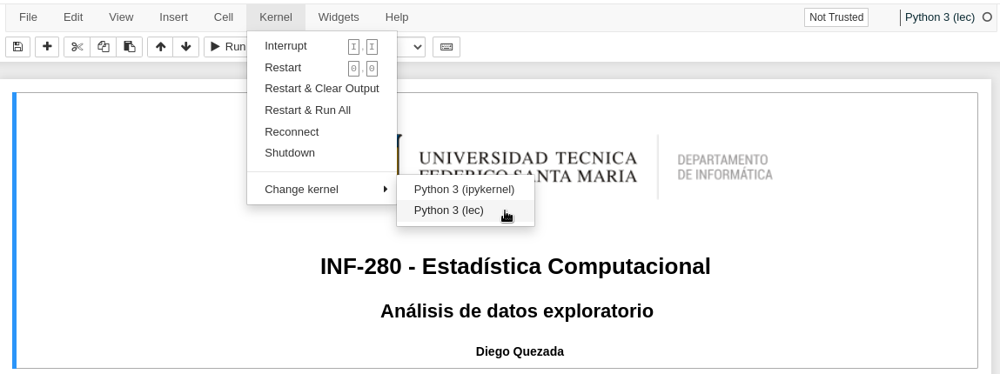

# 1. Introducción

La siguiente guía indica el paso a paso para configurar su computador con todas las librerías necesarias en un ambiente virtual para desarrollar los Laboratorios de Estadística Computacional.

# 2. Prerequisitos

Esta guía asume que su computador cuenta con los siguientes programas ya instalados:

1. [Python](https://www.python.org/downloads/)
2. [Anaconda](https://docs.anaconda.com/anaconda/install/index.html)

Notar que no es necesario que utilice una distribución de Linux para el desarrollo de los laboratorios, sin embargo, es recomendado.

# 3. Ambiente virtual de Anaconda

Un [ambiente virtual](https://docs.conda.io/projects/conda/en/latest/user-guide/tasks/manage-environments.html#creating-an-environment-from-an-environment-yml-file) de Anaconda es una carpeta que contiene una especificación de todas las librerías de Python necesarias para realizar una tarea. Notar que esto tiene un sin número de ventajas, entre ellas:

1. Mantener las librerías necesarias para un proyecto encapsuladas en un ambiente.
2. Utilizar distintas versiones de Python y/o sus librerías facilmente.
3. Comunicar las depedencias.
4. Facilitar la reproducción y ahorrarse el clásico problema "pero si en mi computador funcionaba :thinking:"

## 3.1 Archivo de configuración

Para especificar las librerías solo debe crear un archivo llamado ``environment.yml`` con el nombre de las librerías que necesita:

```yml
name: lec
dependencies:
  - python
  - pip
  - ipykernel
  - numpy
  - pandas
  - matplotlib
  - plotly
```

## 3.2 Crear ambiente

Para crear un ambiente Anaconda a partir de un archivo llamado ``environment.yml`` y luego activarlo en la consola ejecute los siguientes comandos:

```bash
conda env create -f environment.yml
conda activate lec
```

Para integrar el ambiente Anaconda recién creado con Jupyter Notebook es necesario crear un Jupyter Kernel:

```bash
python -m ipykernel install --user --name=lec --display-name="Python (lec)"
```

> Para eliminar un Kernel puede utilizar el comando ``jupyter kernelspec uninstall lec``

Luego, abra una nueva terminal e inicie Jupyter Notebook:

```bash
jupyter-notebook
```

Finalmente, abra un archivo ``.ipynb`` y en la sección Kernels seleccione el Jupyter Kernel recien creado:




## 3.3 Actualizar ambiente

En caso de que necesite agregar nuevas librerías a su ambiente Anaconda puede modificar el archivo ``environment.yml`` y ejecutar el siguiente comando:

```bash
conda env update --prefix ./env --file environment.yml  --prune
```

## 3.4 Eliminar ambiente

Para eliminar un ambiente Anaconda siemplemente ejecute el siguiente comando:

```bash
conda remove --name lec --all
```